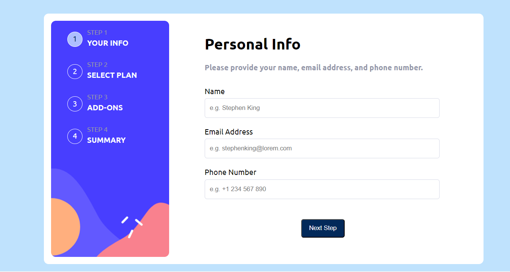
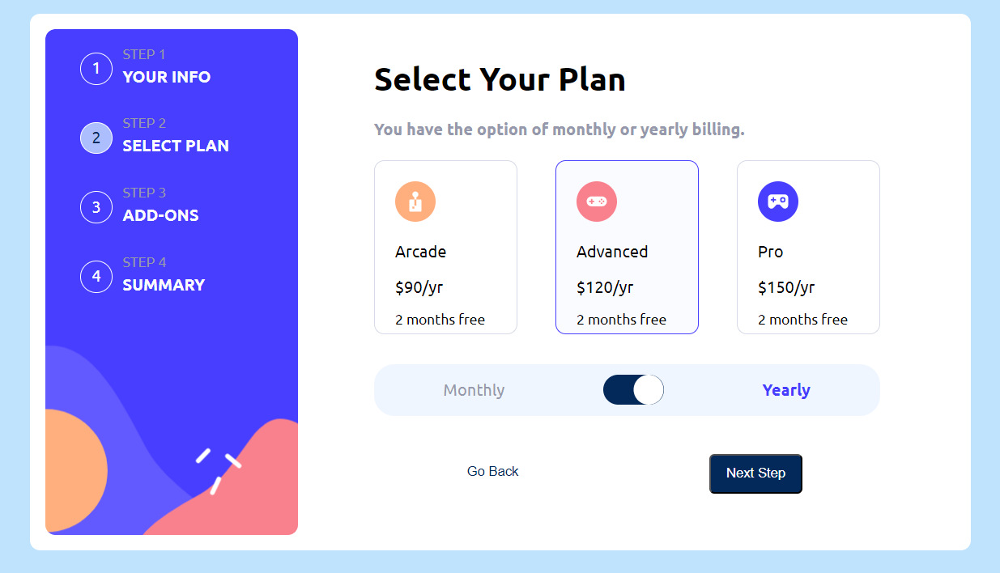

# Multi-Step Form - React.js

This is a multi-step form project built using React.js for the Frontend Mentor website. The project aims to create a user-friendly form with multiple steps and validation for each step. Users can input their information across multiple steps and proceed to the next step only after successfully completing the current one.

## Features

- Multi-step form with a progress indicator.
- Validation for each step, ensuring accurate data input.
- Error messaging for incorrect inputs.
- User-friendly interface with clear instructions.
- Responsive design for mobile and desktop.

### Links
- Live Site URL: [Live site URL](https://willowy-hotteok-baa110.netlify.app/)

## Screenshots

## Technologies Used
- React.js: A JavaScript library for building user interfaces.
- JavaScript: The programming language used for the app's logic.
- CSS: Styling for the user interface.
- HTML: The structure of the web page.

## Author

- Frontend Mentor - [@Ibrahimali2020](https://www.frontendmentor.io/profile/Ibrahimali2020)
- Twitter - [@Ibrahim2016egy](https://www.twitter.com/Ibrahim2016egy)

